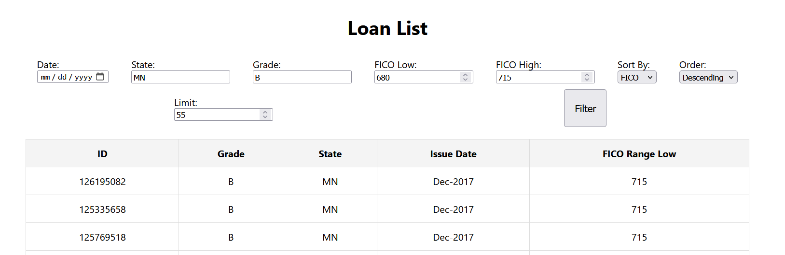

# Loan Application

This project is a full-stack application that provides an API to fetch loan data and a frontend to display the data.

Here is an example screenshot of the Loan List application:



## Table of Contents
1. [Project Structure](#project-structure)
2. [Backend](#backend)
    - [Running the Backend](#running-the-backend)
    - [API Endpoints](#api-endpoints)
    - [Query Parameters](#query-parameters)
    - [Example URLs for Testing](#example-urls-for-testing)
3. [Frontend](#frontend)
    - [Running the Frontend](#running-the-frontend)
4. [Technologies Used](#technologies-used)

## Project Structure

- `loanApp/` - Contains the Kotlin backend application.
- `loan-react/` - Contains the React frontend application.

## Backend

The backend is built with Kotlin and Ktor, and it uses an SQLite database.

### Running the Backend

1. Place the [LoanStats_securev1_2017Q4.sqlite](https://drive.google.com/file/d/1nvkQHOz2KVLRjnhYxdziVsBQzWwj81Ae/view?usp=share_link) file in the backend project root within `loanApp/`.
2. Open the project in IntelliJ IDEA Ultimate.
3. Run the `main` function in `Main.kt` to start the server.

### API Endpoints

- **GET /loans** - Retrieves a list of loans with optional query parameters for filtering and sorting.

### Query Parameters

- `date`: Filter by issue date (e.g., `2020-01-01`).
- `state`: Filter by address state (e.g., `CA`).
- `grade`: Filter by loan grade (e.g., `A`).
- `ficoLow`: Filter by minimum FICO range (e.g., `600`).
- `ficoHigh`: Filter by maximum FICO range (e.g., `700`).
- `sortBy`: Sort by `date`, `state`, `grade`, or `fico`.
- `order`: Ascending by default or set `desc`.
- `limit`: Limit the number of results (e.g., `50`).

### Example URLs for Testing

1. Retrieve the top 100 loans:
    ```bash
    GET http://localhost:8080/loans
    ```

2. Filter by date:
    ```bash
    GET http://localhost:8080/loans?date=2020-01-01
    ```

3. Filter by state:
    ```bash
    GET http://localhost:8080/loans?state=CA
    ```

4. Filter by grade:
    ```bash
    GET http://localhost:8080/loans?grade=A
    ```

5. Filter by minimum FICO range:
    ```bash
    GET http://localhost:8080/loans?ficoLow=600
    ```

6. Filter by maximum FICO range:
    ```bash
    GET http://localhost:8080/loans?ficoHigh=700
    ```

7. Sort by date:
    ```bash
    GET http://localhost:8080/loans?sortBy=date
    ```

8. Sort by state:
    ```bash
    GET http://localhost:8080/loans?sortBy=state
    ```

9. Sort by grade:
    ```bash
    GET http://localhost:8080/loans?sortBy=grade
    ```

10. Sort by FICO range:
    ```bash
    GET http://localhost:8080/loans?sortBy=fico
    ```

11. Limit the number of results:
    ```bash
    GET http://localhost:8080/loans?limit=50
    ```

12. Combine filters and sorting:
    ```bash
    GET http://localhost:8080/loans?state=CA&grade=A&ficoLow=600&ficoHigh=700&sortBy=date&order=desc&limit=50
    ```

## Frontend

The frontend is built with React.

### Running the Frontend

1. Navigate to the `loan-react` directory.
2. Install dependencies:
    ```sh
    npm install
    ```
3. Start the frontend:
    ```sh
    npm start
    ```

## Technologies Used

- **Backend**: Kotlin, Ktor, Exposed, SQLite, HikariCP
- **Frontend**: React, Axios
